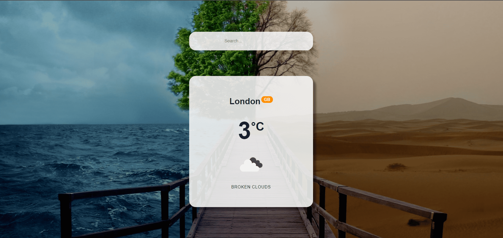

Weather Progressive Web App (PWA): Where Web Meets Excellence
=============================================================  

[Live Website](https://utkarsh-weather-app-pwa.netlify.app/)  

The "Weather Progressive Web App" GitHub repository is a testament to the modern approach to web development, leveraging ReactJS to create a cutting-edge Progressive Web App (PWA) focused on weather information. PWAs are revolutionizing the web experience and this project showcases how they blend native-like capabilities and reliability while maintaining a single codebase for universal accessibility.

## Key Highlights:

1. *ReactJS Power*: The use of ReactJS empowers this PWA with a responsive, dynamic and user-friendly interface.

2. *Weather Insights*: The app offers valuable weather information, ensuring users are always informed about the elements.

3. *PWA Magic*: Progressive Web Apps harness the latest web features, allowing the app to be installed across devices, enhancing accessibility and convenience.

4. *Universal Reach*: With a single codebase, this PWA can be accessed and installed by users worldwide, providing a consistent experience.

5. *Seamless Integration*: The app integrates seamlessly with the user's device, delivering a native app-like feel and functionality.

The "Weather Progressive Web App" repository isn't just about weather; it's about embracing the future of web development. Whether you're a developer, a weather enthusiast or simply curious about the possibilities of PWAs, this project serves as an illuminating example of what's possible when the web meets excellence. Explore, learn and be inspired by the future of web apps.  

  
